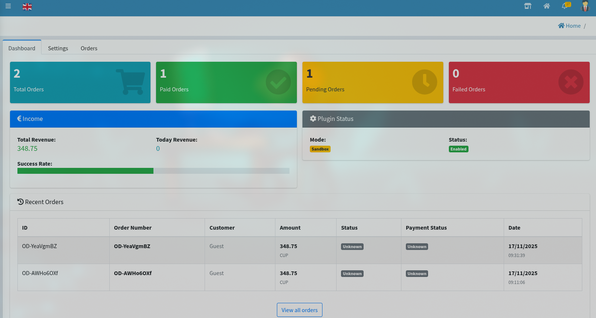
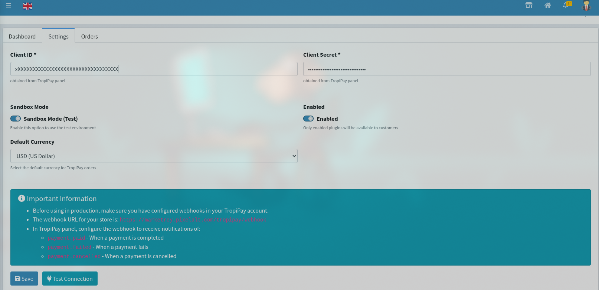
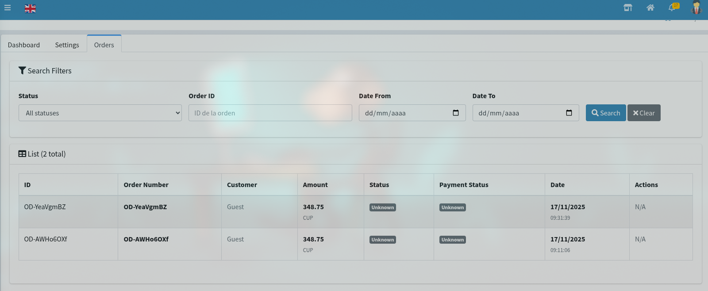

# TropiPay Payment Gateway v3 for S-Cart GP247

## Descripción
Plugin completo de integración con TropiPay API v3 para S-Cart GP247. Permite aceptar pagos seguros mediante TropiPay.

## Características
- ✅ Integración completa con TropiPay API v3
- ✅ Autenticación OAuth2 con Bearer tokens
- ✅ Creación de enlaces de pago seguros
- ✅ Manejo de webhooks en tiempo real
- ✅ Soporte multiidioma (ES/EN)
- ✅ Modo sandbox y producción
- ✅ Confirmación automática de pagos
- ✅ Logs detallados de errores

## Instalación

1. **Descargar el plugin**
   - Descarga el archivo `TropiPay-v1.0.0.zip`

2. **Instalar desde el administrador**
   - Ir a: Extensiones -&gt; Plugins
   - Click en "Subir plugin"
   - Seleccionar el archivo ZIP
   - Click en "Instalar"

3. **Configurar el plugin**
   - Ir a: Configuración -&gt; Métodos de pago -&gt; TropiPay
   - Ingresar:
     - Client ID (obtenido de TropiPay)
     - Client Secret (obtenido de TropiPay)
     - Activar/Deshactivar modo sandbox
     - Habilitar el método de pago

4. **Configurar Webhooks (Producción)**
   - En tu cuenta TropiPay, configurar el webhook URL:

